# Overview

We are going to construct a mental model of a GPU

We will start simple and slowly add accuracy and complexity

# Part 1: What is a GPU? {.section}

# What is a GPU?

GPU is a processor with a dedicated memory area

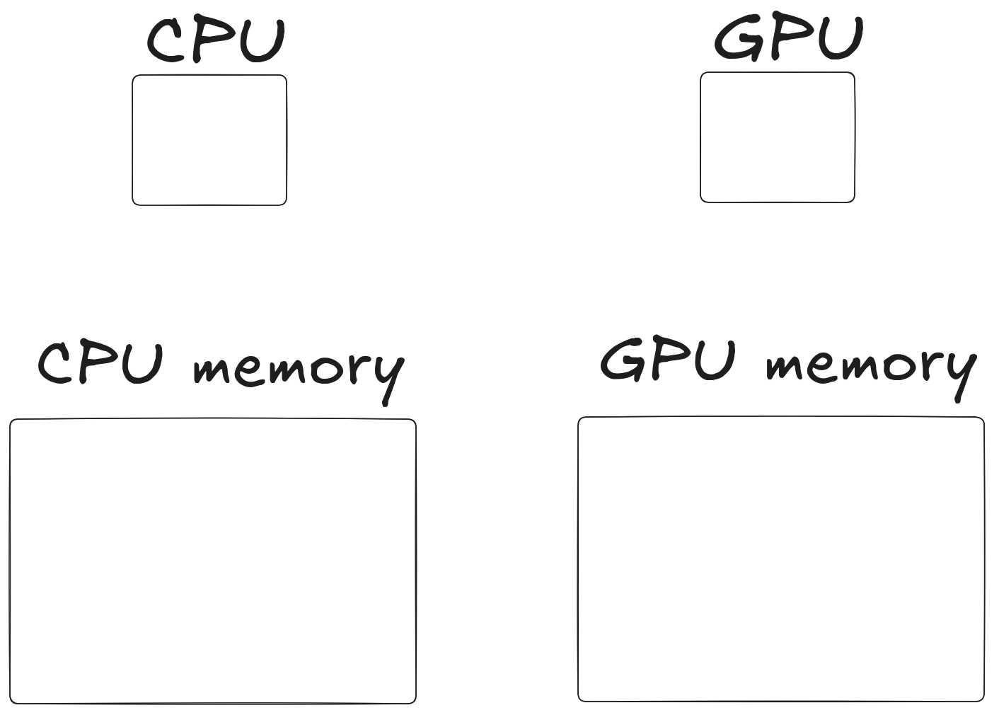{.center width=50%}

::: notes

On the left we have the CPU with it's dedicated memory

On the right we have the GPU with it's dedicated memory

:::

# How do I use the GPU?

:::::: {.columns}
::: {.column width="50%"}
To use it, you have to

1. Copy memory from CPU to GPU
:::
::: {.column width="50%"}
{.center width=100%}
:::
::::::

# How do I use the GPU?

:::::: {.columns}
::: {.column width="50%"}
To use it, you have to

1. Copy memory from CPU to GPU
2. Tell the GPU what to do with that data
:::
::: {.column width="50%"}
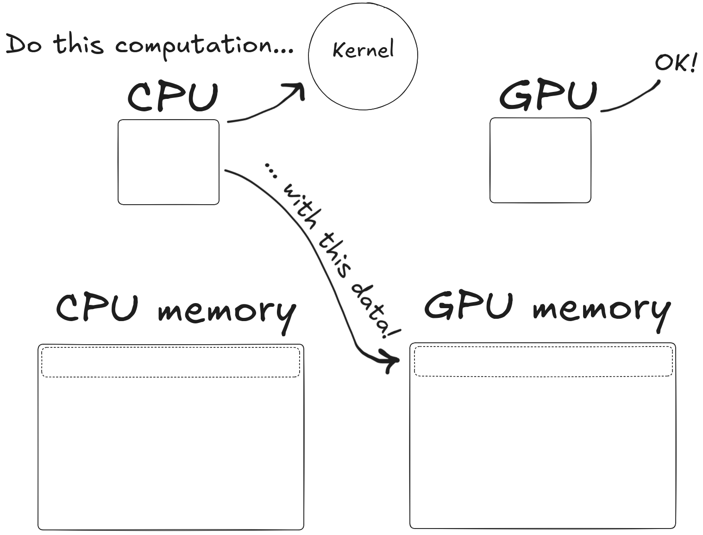{.center width=100%}
:::
::::::

# How do I use the GPU?

:::::: {.columns}
::: {.column width="50%"}
To use it, you have to

1. Copy memory from CPU to GPU
2. Tell the GPU what to do with that data
3. Wait for the GPU to finish doing what you told it to do
:::
::: {.column width="50%"}
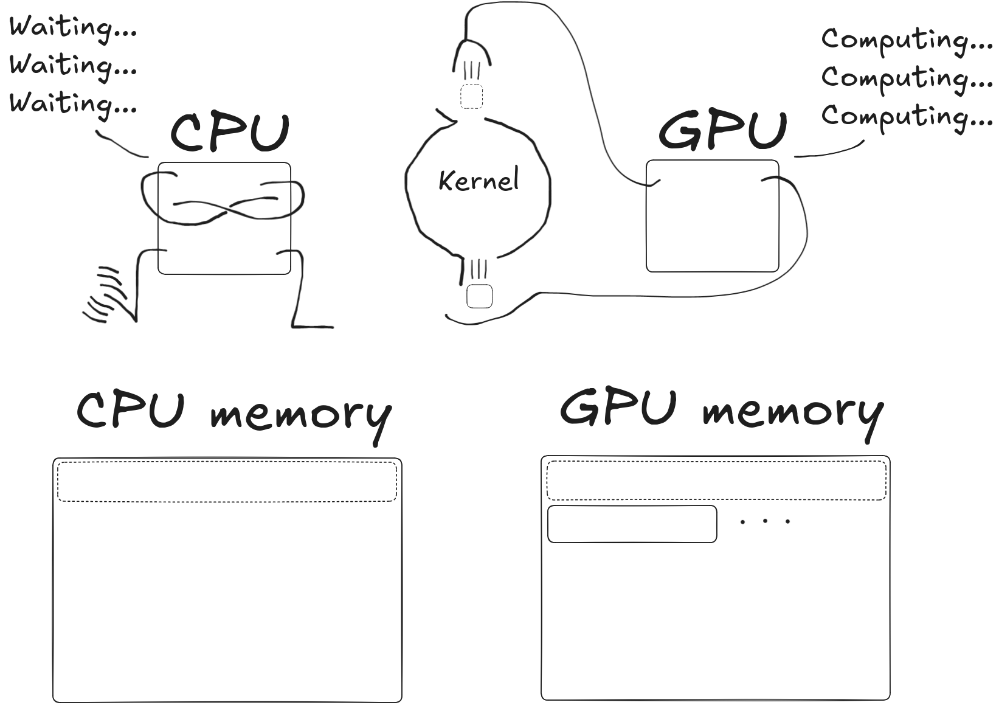{.center width=100%}
:::
::::::

# How do I use the GPU?

:::::: {.columns}
::: {.column width="50%"}
To use it, you have to

1. Copy memory from CPU to GPU
2. Tell the GPU what to do with that data
3. Wait for the GPU to finish doing what you told it to do
4. Copy memory from GPU back to the CPU
:::
::: {.column width="50%"}
{.center width=100%}
:::
::::::

# Why?

But why?

Why move data back and forth from CPU to GPU to CPU?

What's the benefit?

::: notes
This begs the question(s):

What's the point of moving data to the GPU, doing the computation there, then moving it back, instead of just doing the computation locally by the CPU?

Do GPUs run faster that CPUs?

What's the benefit?
:::

# GPU as a wide SIMD unit

::: notes
The answer to the penultimate question is no: GPUs usually have 2-3 times lower clock speeds than CPUs: 1 GHz vs 2-4 GHz.

It makes sense to move data to the GPU and let it do the computation, because, although they run slower, GPUs are massively parallel. You could think of GPUs as very, very wide SIMD or vector units. Think thousands of lanes wide.
:::
{.center width=80%}

# SIMD

::: notes
SIMD stands for Single Instruction, Multiple Data. This is literal: the vector unit performs the same exact instruction (e.g. +) for multiple pieces of data at the same time, i.e. during the same cycle.

So instead of doing c = a + b for a single a and a single b, yielding a singular c, you do it for vectors of values a and b. Then you get a vector of values c. This means thethroughput, i.e. "how many elements you process in a given amount of time", of a vector unit is large.

The concept of a vector unit is not novel, nor is it unique to the GPU. CPUs have vector units as well, but they are narrower than on a GPU.
:::

::: incremental
- SIMD = Single Instruction, Multiple Data
- Same exact instruction (e.g. "integer add") to multiple pieces of data
- Throughput: Width of unit $\times$ throughput of scalar unit
- CPUs & GPUs both use SIMD
:::

# Scalar addition

Element-wise add for arrays `a` and `b` resulting in array `c`

:::::: {.columns}
::: {.column width="50%"}
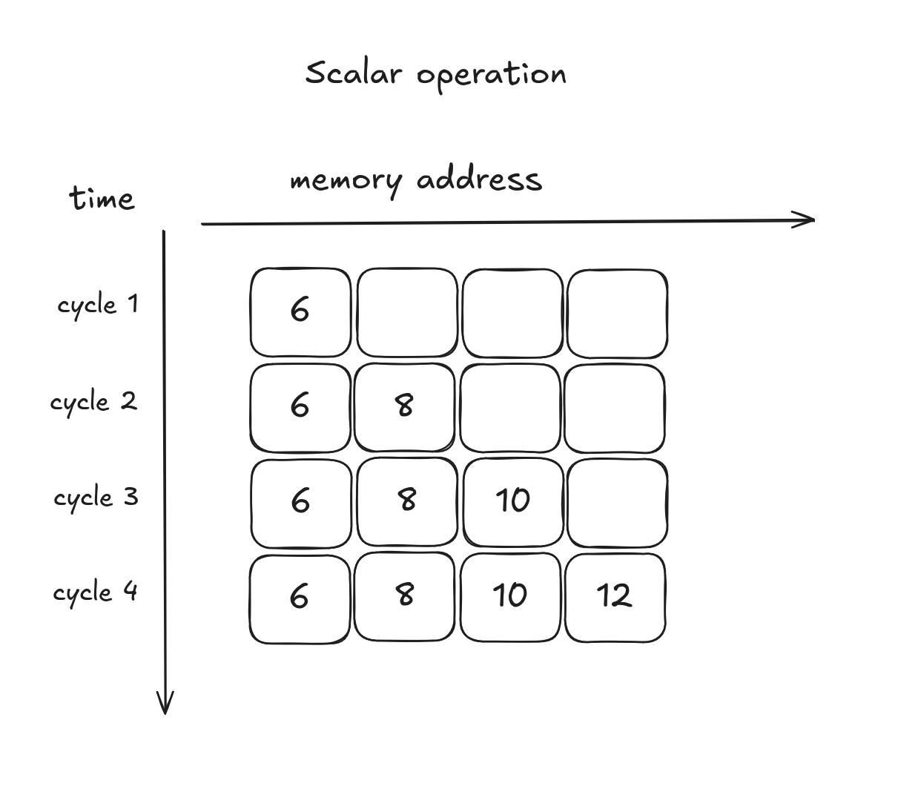{.center width=80%}
:::
::: {.column width="50%"}
 \
 \
```cpp
int a[4] = {1, 2, 3, 4};
int b[4] = {5, 6, 7, 8};
int c[4] = {0, 0, 0, 0};

for (int i = 0; i < 4; i++) {
    c[i] = a[i] + b[i];
}
printf("{}", c); // "6, 8, 10, 12"
```
:::
::::::

4 cycles, 4 elements: throughput = 1


# SIMD addition

Element-wise add for arrays `a` and `b` resulting in array `c`

:::::: {.columns}
::: {.column width="50%"}
 \
{.center width=80%}
:::
::: {.column width="50%"}
 \
 \
```cpp
int a[4] = {1, 2, 3, 4};
int b[4] = {5, 6, 7, 8};
int c[4] = {0, 0, 0, 0};

simd_add(a, b, c);
printf("{}", c); // "6, 8, 10, 12"
```
:::
::::::

1 cycle, 4 elements: throughput = 4

# Which is faster, CPU or GPU?

::: notes
Let's gather our thoughts.

- Moving data from the CPU memory to the GPU memory takes time
- Doing the computation on the GPU takes time
- Finally, moving the data back from the GPU memory to the CPU memory takes time

This is all time that could be spent doing the computation on the CPU.

But we just discovered, that the GPUs are massive parallel units, and thus they can perform the same instruction to multiple pieces of data at the same time.

So which is faster:

1. Doing the computation on the CPU, or
2. Moving data back and forth and using the GPU to do the computation?

A simple answer is: it depends on how much data you have.
:::

It takes time to

- Move data to the GPU
- Compute on the GPU
- Move results to the CPU

So is it faster to use the CPU or the GPU?

# Runtimes of Axpy
::: notes
In this graph we have a plot of problem size (horizontal axis) vs runtime (vertical axis).

The legend tells us there are four different versions of the computation:

1. A completely serial computation
2. OpenMP with two threads
3. OpenMP with 64 threads
4. GPU

The serial part runs fastest, if we have less than $10^4$ elements.

Then we see the OpenMP version with 64 threads dominate, if the number of elements is between $10^4$ and $3 \times 10^7$.

Finally, once the problem size is larger than $3 \times 10^7$, the GPU version starts to dominate.

We can also see the GPU and OMP64 versions having a constant runtime, when the number of elements is $< 3 \times 10^7$, even if the problem size increases.

This indicates that the problem is too small to actually use all the available resources: scaling up the problem doesn't cost anything extra, because there are an abundance of free units for doing the work.

Another thing visible is the runtime penalty of using GPUs and multithreaded CPUs:
The runtime difference between the serial version and the other versions is the overhead of using the more parallel versions.

This means it's actually much faster to just do the computation locally, with a single thread, than it is to either spin up a bunch of threads and distribute the problem among them, or copy the data to the massively parallel GPU and let it solve the problem.

Now we are better equipped to understand why and when should we use a GPU and when to do the work locally.

There are many more things to consider, and one should always make informed decisions by measuring the actual performance of the application instead of relying on generic guidelines. But guidelines serve as a starting point.
:::


::::::::: {.columns}
:::::: {.column width="60%"}
::: incremental
- four different versions
- serial, OMP64, GPU dominate at different problem sizes
- idle resources, when problem is small
- overhead of parallellizing
- depends heavily on the type of the problem (profile, don't assume!)
:::
::::::
:::::: {.column width="40%"}
{.center width=100%}
::::::
:::::::::

# Recap

::: notes
Let's do a review:

GPU is a massively parallel processor with its own memory space.

You copy data from the CPU memory to the GPU memory and tell the GPU to do some computation on that data.

The GPU can execute instructions on thousands of pieces of data at the same time.

Using a GPU makes sense, if you have enough data to crunch. If not, it's better to do the computation locally with the CPU.
:::
::: incremental
- massively parallel processor
- own memory space --> requires data movement
- performs instructions to multiple pieces of data at the same time
- useful when you have a lot of data
:::

# Part 2: Model of GPU Hardware {.section}

# GPU as a wide SIMD unit

::: notes
Earlier we learned GPUs could be thought of as very wide SIMD units.

This is, of course, quite silly.

Why?

Becaues a vector unit executes the same instruction to multiple pieces of data per cycle.

If we have thousands of lanes, every time we want to execute some instruction to say 32 or 128 or even 256 elements, we lose most of our performance.
Most of the hardware is doing nothing.
:::
:::::: {.columns}
::: {.column width="40%"}
 \
32 operations

1024 lanes

Utilization: $$ 32 / 1024 = 1 / 32 \approx 3\% $$
:::
::: {.column width="60%"}
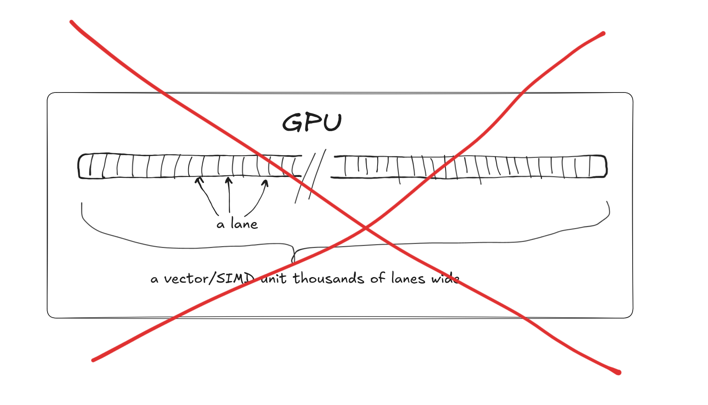{.center width=100%}
:::
::::::

# GPU as a collection of independents vector units

::: notes
A better model of a GPU is a collection of multiple independent vector units.

On the left we have the GPU consisting of 32 independent vector units.
On the right we have a single vector unit, 16 lanes wide.

What does independent mean here?

It means each of these units can perform a single instruction to it's pieces of data, regardless of what, if anything, the other vector units are doing.

Usually the vector units themselves have something like 16 lanes.

This means this GPU could do (lanes/unit x num_units) = $16 \times 32 = 512$ instructions per cycle. And since the units are independent, not all 512 of those instructions have to be the same.
:::

:::::: {.columns}
::: {.column width="50%"}
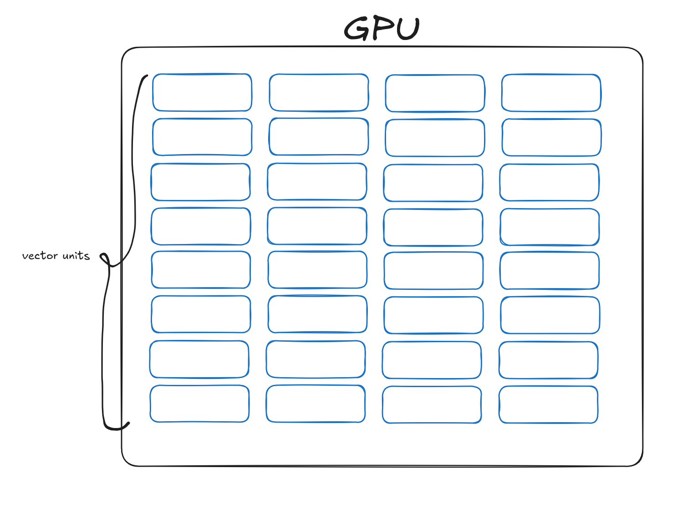{width=100%}

32 vector units
:::
::: {.column width="50%"}
{width=100%}

A vector unit, 16 lanes wide
:::
::::::

# GPU as a collection of independents vector units

::: notes
In fact, the GPU could do 32 different instructions, each for 16 different elements.
:::
:::::: {.columns}
::: {.column width="50%"}
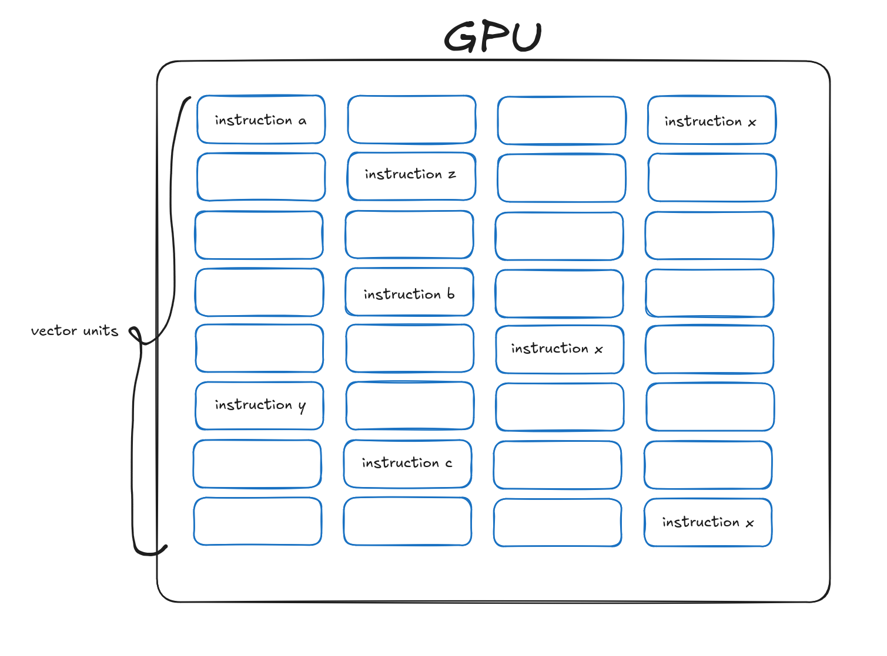{width=100%}

32 vector units, executing different instructions
:::
::: {.column width="50%"}
{width=100%}

A vector unit, 16 lanes wide
:::
::::::

# Who controls the vector units?

::: notes
Who or what tells the different vector units what instruction to do and to which data? Am I, the programmer, responsible for that?

If you're familiar with vectorizing code on the CPU, a reasonable answer is
"Yes, I, the programmer, am responsible".

For GPUs, you could write the vector instructions by hand using a (hardware vendor specific) low level assembly-like language, but instead it's more common and more productive to write in a higher level language like Cuda/HIP/Sycl.

With these languages, the nature of the GPU as a collection of independent vector units is actually hidden from the programmer. The programming model is called SIMT, for Single Instruction, Multiple Threads.

So if the programmer isn't directly responsible for mapping data to vector registers and then calling vector instructions, how does it happen?
:::

::::::::: {.columns}
:::::: {.column width="60%"}
Hand written SIMD for CPUs
```cpp
// Multiply 8 floats by another 8 floats
// on the CPU, using SIMD.
template<int offsetRegs>
inline __m256 mul8(const float* p1, const float* p2)
{
    constexpr int lanes = offsetRegs * 8;
    const __m256 a = _mm256_loadu_ps(p1 + lanes);
    const __m256 b = _mm256_loadu_ps(p2 + lanes);
    return _mm256_mul_ps(a, b);
}
```
[Source](https://stackoverflow.com/questions/59494745/avx2-computing-dot-product-of-512-float-arrays/59495197#59495197)
::::::
:::::: {.column width="40%"}
::: incremental
- Could do the same on the GPU using (hardware vendor specific) assembly-like language
- More common to use higher level APIs like Cuda/HIP/Sycl
- SIMT = Single Instruction, Multiple Threads
:::
::::::
:::::::::

# GPU as a collection of processors

::: notes
An even better model of a GPU is a collection of independent and very simple processors, which contain vector units.

AMD calls these processors Compute Units (CU), Nvidia calls them Streaming Multiprocessors (SM) and Intel has many names for them, one of which is Execution Unit (EU).

The "other hardware" block hides a lot of details. We don't need to understand those details to write correct GPU code, though it it useful to understand them to write performant GPU code.

Let's compare this simple model to an actual schematic of two GPUs:

MI250X from AMD, as found on LUMI and A100 from Nvidia, as found on Mahti.
:::

:::::: {.columns}
::: {.column width="50%"}
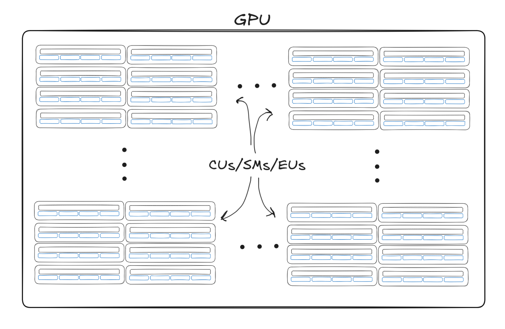{width=100%}
Tens or hundreds of simple processors
:::
::: {.column width="50%"}
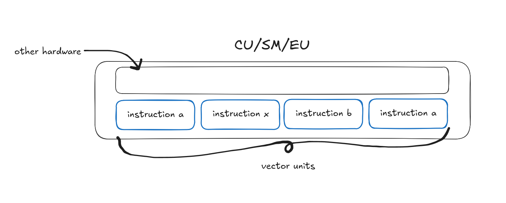{width=100%}

- CU = Compute Unit (AMD)
- SM = Streaming Multiprocessor (Nvidia)
- EU = Execution Unit (Intel)
:::
::::::

# MI250X

::: notes
The small blocks with "CU" on them are, surprise surprise, the CUs.
Most of the other stuff in the schematic is related to memory and connecting the GPU to other hardware

Next take a look at the individual CU
:::
::::::::: {.columns}
:::::: {.column width="70%"}
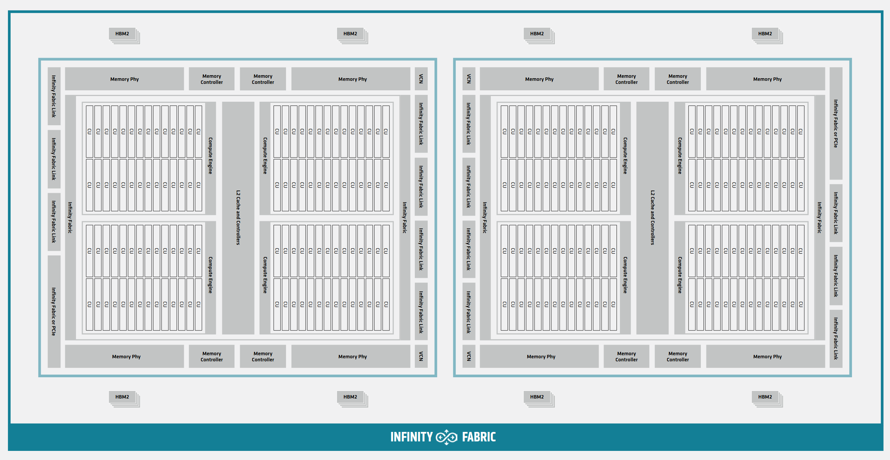{width=100%}
::::::
:::::: {.column width="30%"}
::: incremental
- CUs
- memory
- links to other hardware
:::
::::::
:::::::::

# MI250X, Compute Unit

::: notes
Here we have the "shader core"s, which are the vector units talked about earlier. Notice there are four sets of 16 cores.

Additionally we have "other hardware" which we abstracted away previously. As mentioned, most of this stuff is unnecessary for writing correct GPU programs, but useful for writing performant programs.

The most important other things for a starting programmer are the Local Data Share (LDS) and L1 Cache. These are both related to the memory hierarchy of the GPU, which we'll learn about in later lectures.

Now, the A100 from Nvidia, as found on Mahti
:::
::::::::: {.columns}
:::::: {.column width="70%"}
 \
 \
{width=100%}
::::::
:::::: {.column width="30%"}
::: incremental
- "shader core" = a lane of vector unit
    - four sets of 16
- LDS/L1\$
- other hardware
:::
::::::
:::::::::

# A100

::: notes
This image has a bit more detail than the MI250X one, but the basics are the same.

We have
- A lot of SMs,
- memory stuff, and
- connections to other hardware

The abbreviations GPC and TPC (Graphics Processing Cluster, Texture Processing Cluster) come, unsurprisingly, from the graphics side of GPUs and are not important for this discussion and can be safely ignored.

Now the SM
:::

::::::::: {.columns}
:::::: {.column width="70%"}
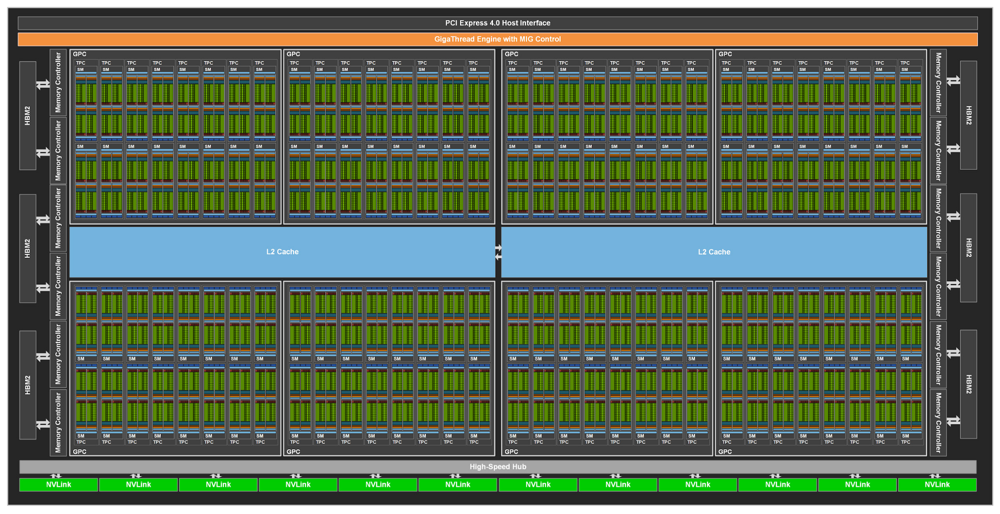{width=100%}
::::::
:::::: {.column width="30%"}
::: incremental
- SMs
- memory
- links to other hardware
:::
::::::
:::::::::

# A100, Streaming Multiprocessor

::: notes
Similar to the CU of the MI250X, we have "four vector units". As seen on the diagram, this is a heavily simplified statement, but we can see there are four sub-partitions to the SM (SMSP, Streaming Multiprocessor Sub-Partition).

Each of these SMSPs have cores for handling INT32, FP32 and FP64 computation, as well as "other hardware", e.g. scheduler, registers and caches.

Again, the most important new thing here for a beginner programmer is the L1 Data Cache / Shared Memory at the bottom of the image. We'll learn about these later.
:::
::::::::: {.columns}
:::::: {.column width="30%"}
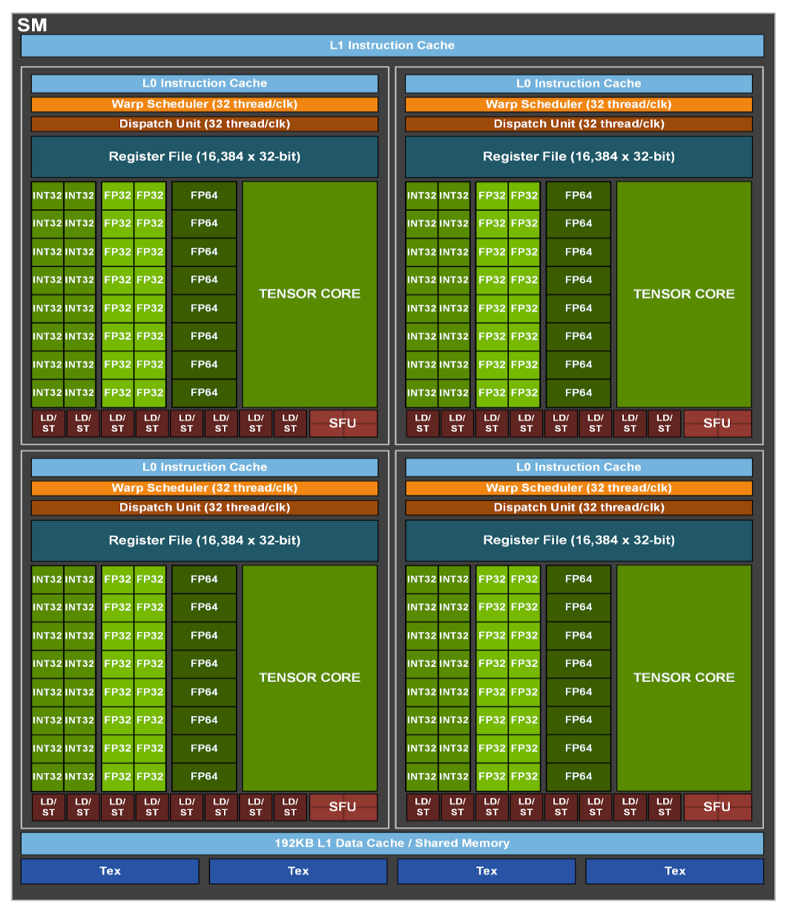{width=100%}
::::::
:::::: {.column width="70%"}
::: incremental
- four SM sub-partitions (SMSP)
    - cores for INT32, FP32, FP64
- L1D\$/Shared memory
- other hardware
:::
::::::
:::::::::

# Recap

::: notes
Let's do a review:

GPU is a massively parallel processor with its own memory space. You copy data from the CPU memory to the GPU memory and tell the GPU to do some computation on that data. This makes sense, if you have enough data to crunch. If not, it's better to do the computation locally with the CPU.

The GPU gets it computational power from tens or hundreds of simple processors called compute units, streaming multiprocessors or execution units, depending on the hardware vendor. These simple processors have multiple vector units inside them (in addition to other hardware) and they can execute a single instruction per cycle per vector unit. The entire GPU can execute $10^3 - 10^4$ instructions per cycle. CPUs can execute $10^1 - 10^2$ instructions per cycle.
:::

::: incremental
- massively parallel processor
- own memory space --> requires data movement
- useful when you have a lot of data
- consists of tens or hundreds of simple processors, with multiple vector units per processor
- 1-2 orders of magnitude more instruction per cycle compared to CPUs
:::
# Part 3: Programming GPUs {.section}

# Programming GPUs

::: notes
Now that we've seen the hardware in (some of) its glory, let's finally discuss how one actually programs these things. As mentioned previously, the most common way of doing general purpose GPU computing is with a programming model called Single Instruction, Multiple Threads (SIMT), which was mentioned before.

With SIMT, the programmer writes GPU code from the point of view of a single thread, but within a larger context. Let's look at this through a more familiar lens of CPU code.
:::

::: incremental
- SIMT =  Single Instruction, Multiple Threads
- Write parallel code from the perspective of a single thread
:::

# Programming GPUs

::: notes
Here we have a simple double loop in C++ that sums up two arrays element-wise to a third one.

The larger context is "We have three 2D arrays, a, b, c, which are all $N \times M$ in size and we're executing some block of code $N \times M$ times"

The point of view of a single thread is "I'm going to take this single value from array a, sum it with this single value from array b and store it in this location in array c"
:::
::::::::: {.columns}
:::::: {.column width="40%"}
- Context: Execute some code over the size of the arrays using a douple loop
- Single thread point of view: Perform addition of two elements $c_{ij} = a_{ij} + b_{ij}$
::::::
:::::: {.column width="60%"}
```cpp
void sum_arrays(
    float** a,
    float** b,
    float** c,
    int N,
    int M)
{
	for (int i = 0; i < N; i++) {
		for (int j = 0; j < M; j++) {
			c[i][j] = a[i][j] + b[i][j];
		}
	}
}
```
::::::
:::::::::

# Programming GPUs

::: notes
So what does it mean to write code from the perspective of a single thread?

It means we partially "forget" the larger context, and let "someone else" handle it. Instead we focus on the block of code that is done "for all the elements", in this case $c_{ij} = a_{ij} + b_{ij}$

The GPU version would be something like this.

Here there's no double loop. "Someone else" takes care of it. We're just concerned about what happens to each element.
:::
::::::::: {.columns}
:::::: {.column width="40%"}
::: incremental
- No double loop: "someone else" takes care of it
- Just index "fetching" and the operation $c_{ij} = a_{ij} + b_{ij}$
:::
::::::
:::::: {.column width="60%"}
GPU version
```cpp
void sum_arrays(float** a, float** b, float** c) {
	const int i = my_global_i();
	const int j = my_global_j();
	c[i][j] = a[i][j] + b[i][j];
}
```
::::::
:::::::::

# Division of responsibilities

::: notes
So who is this "someone else" taking care of the larger context?

It's partly us, the programmer and partly the software stack (high level API, runtime library, device driver, etc.) and the hardware device that we're using.

Our responsibility is telling the device how many threads we want to run, and in what configuration.

Examples:
- 32768 threads in 1D
- 32 x 1024 threads in 2D
- 32 x 512 x 2 threads is 3D

After we've supplied this information to the device, it's its responsibility to launch enough threads and with correct thread indices and call the code we've supplied for each of those threads.
:::
Our responsibility: how many threads, in what configuration

::: incremental
- 32768 threads in 1D
- 32 x 1024 threads in 2D
- 32 x 512 x 2 threads in 3D
:::

Device's responsibility: launch enough threads and call the supplied code for each

# Thread hierarchy

::: notes
On the software side, the API helps us with defining the configuration of threads we want the GPU to do work with, by defining three levels of hierarchy, the previous being the building block of the next one:

- a thread
- a block of threads
- a grid of blocks

:::
Thread hierarchy, previous is the building block of the next level

::: incremental
- a thread
- a block of threads
- a grid of blocks
:::

# Thread

::: notes
A single thread is the smallest unit.
:::
::::::::: {.columns}
:::::: {.column width="40%"}
A single thread is the smallest unit
::::::
:::::: {.column width="60%"}
{width=30%}
::::::
:::::::::

# Block of threads

::: notes
A block of threads can be one, two or three dimensional. The dimensions of the block multiplied together gives the total number of threads in a single block.
:::

A block of threads can be 1D, 2D or 3D

:::::: {.columns}
::: {.column width="50%"}
<small>
```cpp
// This struct is defined elsewhere by the API
struct dim3 {
	int32_t x;
	int32_t y;
	int32_t z;
};

// -----------------------------------------------
// In our program we define the size of the block:

// 1D block of 128 threads (128 x 1 x 1 = 128)
dim3 block(128, 1, 1);

// 2D block of 1024 threads (32 x 32 = 1024)
dim3 block(32, 32, 1);

// 3D block of 1024 threads (16 x 8 x 8 = 1024)
dim3 block(16, 8, 8);
```
</small>
:::
::: {.column width="50%"}
{width=80%}
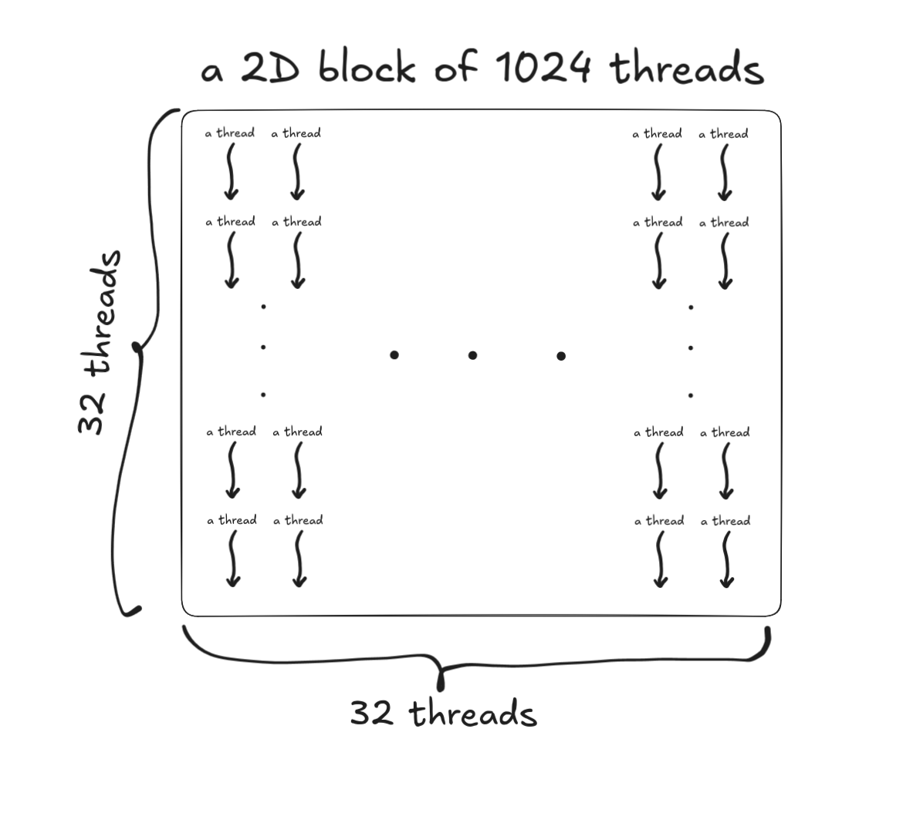{width=45%}
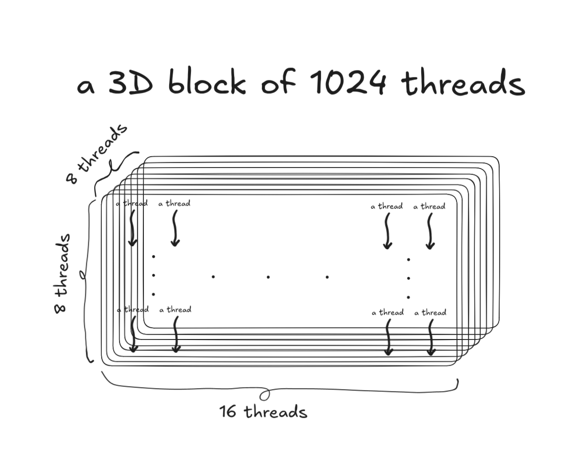{width=45%}
:::
::::::

# Grid of blocks

::: notes
Similarly, a grid of blocks can be one, two or three dimensional.

Likewise, the dimensions multiplied together tell how many blocks there are in a grid.
:::

A grid of blocks can be 1D, 2D or 3D

:::::: {.columns}
::: {.column width="30%"}
<small>
```cpp
// The same struct is used for
// block size and grid size
struct dim3 {
	int32_t x;
	int32_t y;
	int32_t z;
};

// ------------------------
// In our program we define
// the size of the grid:

// 1D grid of 4 blocks (4 x 1 x 1 = 4)
dim3 grid(4, 1, 1);

// 2D grid of 4 blocks (2 x 2 x 1 = 4)
dim3 grid(2, 2, 1);
```
</small>
:::
::: {.column width="70%"}
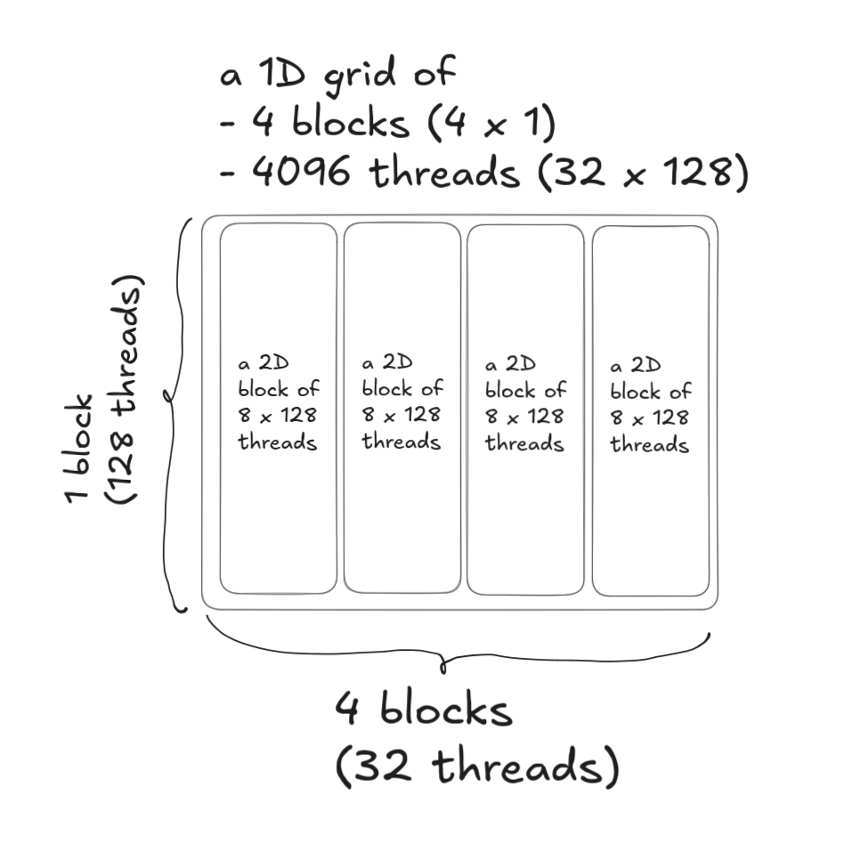{width=40%}
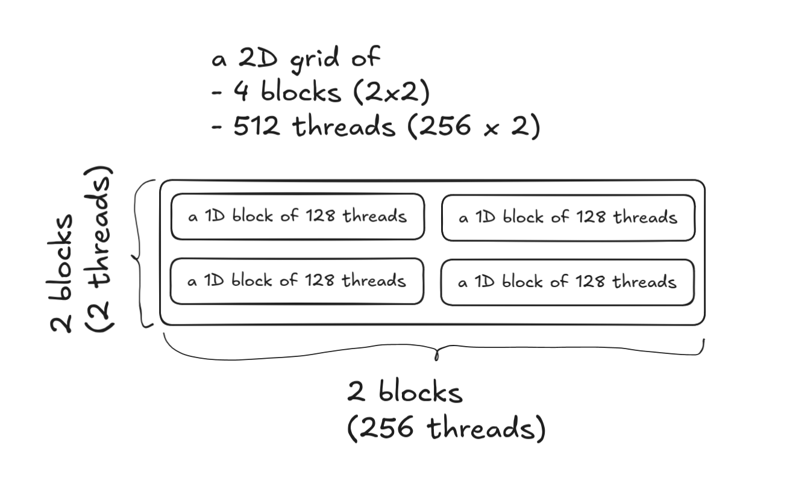{width=55%}
:::
::::::

# Threads, blocks, grids

::: notes
Multiplying the number of blocks in a grid by the number of threads in a block we get the number of threads in a grid.

To run some code on the GPU, we give it a grid. The device performs the given computation for each thread in the grid.
:::
::::::::: {.columns}
:::::: {.column width="50%"}
```cpp
dim3 block(8, 128, 1);
dim3 grid(4, 1, 1);
// Num threads = 8 x 128 x 4 = 4096

// The code in "someKernel" is run
// with 4096 threads
someKernel<<<grid, block>>>(arguments);
// We'll cover this^ special syntax later
```
::::::
:::::: {.column width="50%"}
::: incremental
- threads/grid = threads/block $\times$ blocks/grid
- device always operates over grids
:::
::::::
:::::::::

# Grid - Device

::: notes
So we've defined our grid and written some code. How do these software constructs (thread, block, grid) map to the hardware?

The grid maps to a single device (GPU): we're telling a single device to run some code over a grid that we've defined.
:::
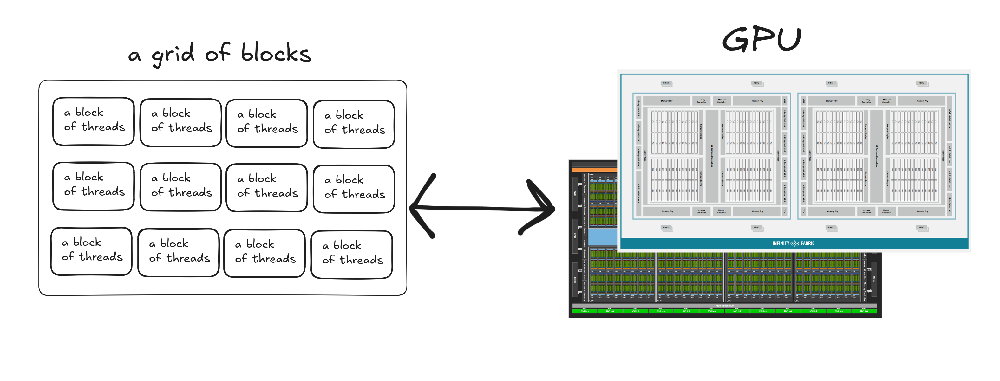{.center width=100%}

# Block - SM/CU

::: notes
Each block of threads in the grid gets mapped to a single CU/SM.
:::
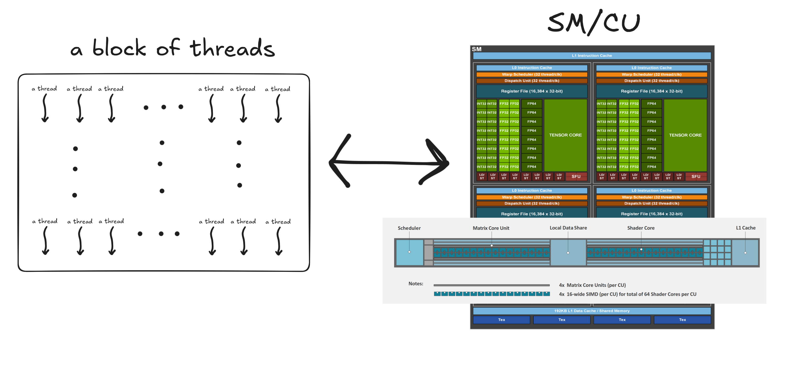{.center width=100%}

# Blocks - SM/CU, cont.

::: notes
Side note: Many blocks (from a single or multiple grids) may map to the same CU/SM.

However, the reverse is not possible. One block always maps to a single CU/SM, never to multiple.
:::
::::::::: {.columns}
:::::: {.column width="50%"}
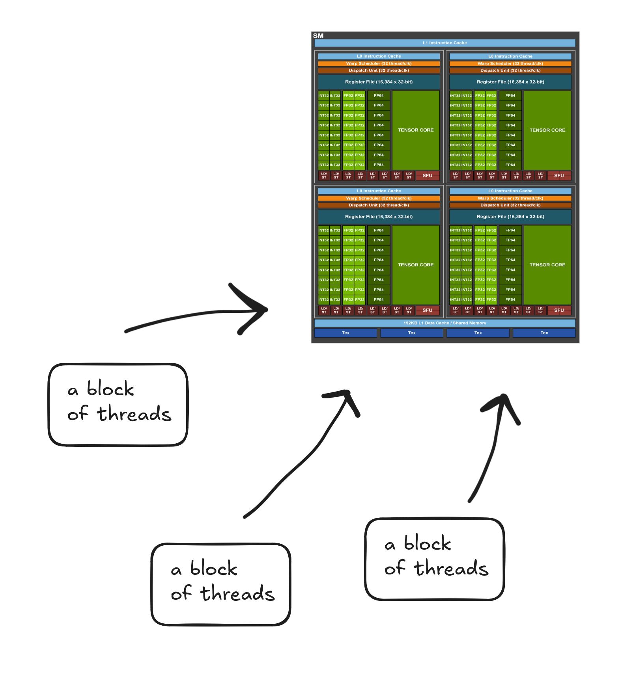{.center width=80%}
::::::
:::::: {.column width="50%"}
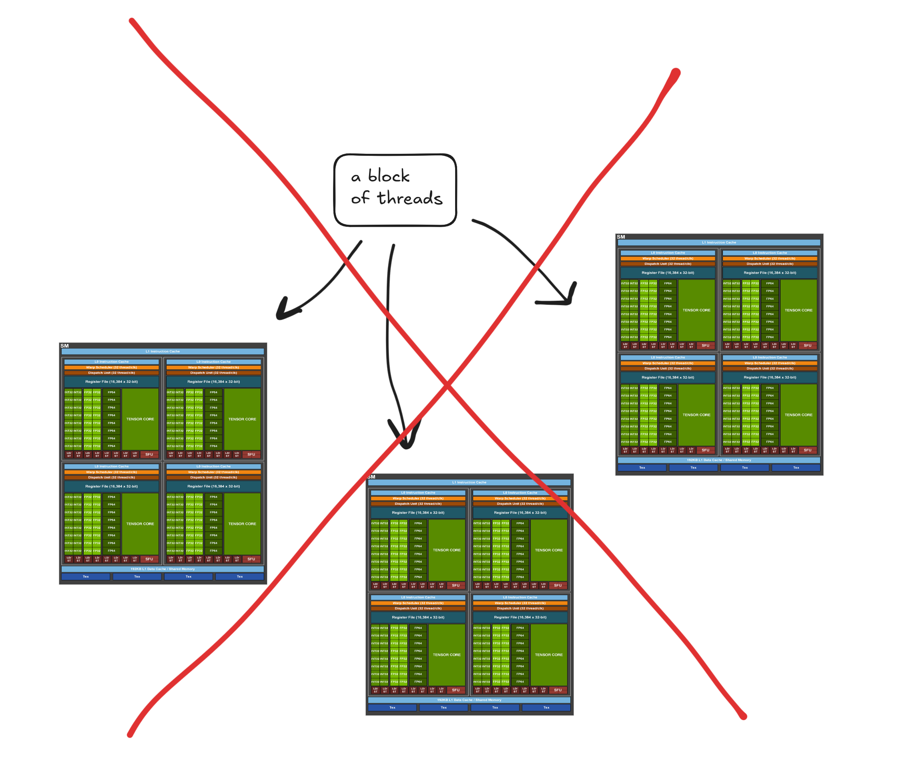{.center width=100%}
::::::
:::::::::

# Warps, wavefronts

::: notes
At the SM/CU, the blocks of threads are further broken down to warps of 32 threads (Nvidia), or wavefronts of 64 threads (AMD)

Each warp/wavefront consists of consecutive 32/64 threads.
:::
SM/CU breaks blocks of threads to

- *warps* of 32 consecutive threads (Nvidia), or
- *wavefronts* of 64 consecutive threads (AMD)

Then, the SM/CU maps each of these warps/wavefronts to a particular SMSP/SIMD unit

# Warps, wavefronts, cont.

<small>
A 1D block of 256x1 threads gets partitioned to

| warp/wavefront ID | thread ID (Nvidia) | thread ID (AMD) |
|-------------------|--------------------|-----------------|
| w0                | 0-31               | 0-63            |
| w1                | 32-63              | 64-127          |
| w2                | 64-95              | 128-191         |
| w3                | 96-127             | 192-255         |
| w4                | 128-159            | -               |
| w5                | 160-191            | -               |
| w6                | 192-223            | -               |
| w7                | 224-255            | -               |
</small>

# Warp/Wavefront - SM/CU

::: notes
Then, the SM/CU maps each of these warps/wavefronts to a particular SMSP/SIMD unit
:::
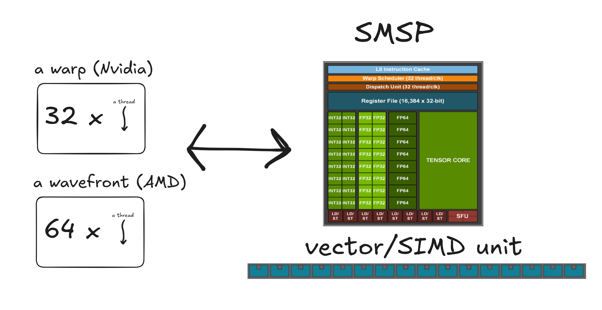{.center width=80%}

# Thread - lane

::: notes
Finally, each thread of a warp/wavefront is mapped to a single lane of a SIMD unit or to a single core of the SMSP.
:::
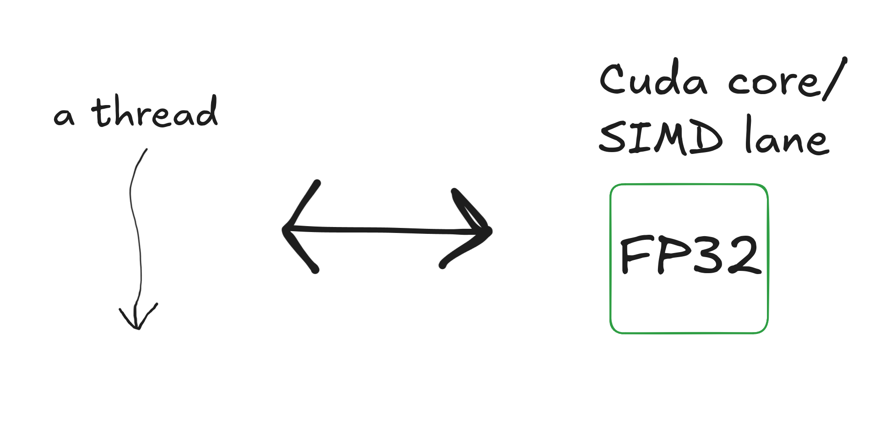{.center width=80%}

# Recap

::: notes
Let's do a review.

The GPU is a massively parallel processor with its own memory space. The processing power of the GPU comes from tens or hundreds of simple processors (CU/SM) working independently and concurrently. These simple processors contain multiple vector units, which perform a single instruction for multiple pieces of data per cycle.

To do some work on the GPU, we write some code from the perspective of a single thread and define a grid of threads using two levels of hierarchy defined by the API: a grid of blocks and a block of threads. We then ask the GPU to run our code for each thread in the grid.

The device maps the grid of threads to its hardware components: all the threads run on the same GPU. The blocks of the grid are mapped to the CUs/SMs. These then break down the blocks to warps or wavefronts of 32/64 consecutive threads and map each warp/wavefront to a SIMD unit or SMSP.
Each SIMD unit/SMSP executes a single instruction per cycle, doing this for all the lanes in the unit.
:::

<small>

::: incremental
- massively parallel processor
- own memory space --> requires data movement
- useful when you have a lot of data
- consists of tens or hundreds of simple processors, with multiple vector units per processor
- 1-2 orders of magnitude more instruction per cycle compared to CPUs
- point of view of a single thread
- a grid of (blocks of) threads
- grid <--> device
- block <--> SM/CU
- warp/wavefront <--> SMSP/SIMD
- thread <--> lane
:::
</small>

# What have we learned?

::: notes
Let's see if we've learned something.

Say, we have the following GPU.
:::

https://siili.rahtiapp.fi/s/gpmWnLY8q#

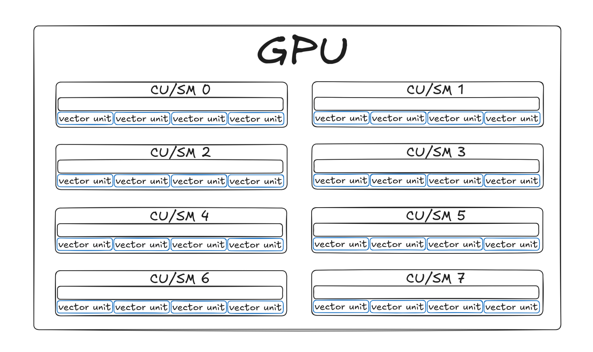{.center width=65%}

# Questions?
