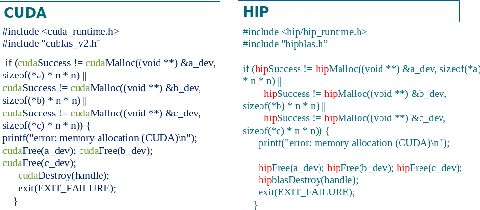

# Heterogeneous-Compute Interface for Portability

- code to run on both **AMD ROCm** and **NVIDIA CUDA** platforms with minimal changes
- the `hipcc` compiler driver calls different compilers depending on the architecture: on **NVIDIA** platforms calls `nvcc` 
- (very) similar to **CUDA**, but designed for cross-platform compatibility
- supports a strong subset of the **CUDA** runtime functionality
- enables fast translation of **CUDA API** calls: most calls can be converted in place by simply replacing `cuda` with `hip`

::: notes
HIP (Heterogeneous-Compute Interface for Portability) is a C++ runtime API and programming model designed by AMD to enable seamless portability between CUDA and ROCm-based GPU architectures. It provides an interface similar to CUDA, allowing developers to write GPU-accelerated code that can run on both NVIDIA and AMD GPUs with minimal changes. The HIP API includes equivalents for CUDA runtime functions, memory management, and kernel launches, as well as a HIPified version of libraries like cuBLAS (hipBLAS) and cuDNN (hipDNN). Developers can use hipify tools to automatically translate CUDA code to HIP, making it easier to migrate applications across different hardware platforms while maintaining high performance.
:::
# CUDA vs. HIP

<div class="column" width=45%>>
```cpp
// CUDA
```
</div>

<div class="column" width=45%>>
```cpp
// HIP
```
</div>

<small>
 <div class="column" width=45%>>
```cpp
cudaMalloc(&d_x,N*sizeof(double));
  
cudaMemcpy(d_x,x,N*sizeof(double),
              cudaMemcpyHostToDevice);
              
cudaDeviceSynchronize();

cublasSgemm(handle, CUBLAS_OP_N, CUBLAS_OP_N, N, N, N, 
                &alpha, d_A, N, d_B, N, &beta, d_C, N);

kernel_name<<<gridsize, blocksize, 
              shared_mem_size, 
              stream>>>
              (arg0,arg1, ...);


              
``` 
</div>

<div class="column" width=45%>
```cpp
hipMalloc(&d_x,N*sizeof(double));

hipMemcpy(d_x,x,N*sizeof(double),
              hipMemcpyHostToDevice);

hipDeviceSynchronize();

hipblasSgemm(handle, HIPBLAS_OP_N, HIPBLAS_OP_N, N, N, N, 
                 &alpha, d_A, N, d_B, N, &beta, d_C, N);

kernel_name<<<gridsize, blocksize, 
              shared_mem_size, 
              stream>>>
              (arg0,arg1, ...);

hipLaunchKernelGGL(kernel_name,
                    gridsize, 
                    blocksize, 
                    shared_mem_size, 
                    stream,arg0,arg1, ...);
```
</div>

</small>


# Porting a CUDA Project: Migrating Workflow

- start on a CUDA platform
- get a fully working HIP version
- compile the HIP code on an AMD machine
- handle platform-specific features through conditional compilation (or by adding them to the open-source HIP infrastructure)

# Porting a CUDA Project: Conversion Methods

- **Manual Code Conversion** (search/replace or incremental)
- **HIPIFY Tools** (automated translation tools)
- **Header Porting** (on the fly translation)

# Automated Translation Tools
- collection of tools that automatically translate CUDA to HIP code
- **hipify-perl**
   * translates to HIP using pattern matching
   * does not require a working CUDA installation
   * can also convert CUDA code, that is not syntactically correct
- **hipify-clang**
   * uses the Clang compiler CUDA source into an Abstract Syntax Tree (AST)
   * generates the HIP source from the AST
   * needs to be able to compile the code
   * requires a working CUDA installation
   * CUDA code needs to be correct

::: notes
hipify-perl is the simplest tool for converting CUDA code to HIP. It works by scanning a directory and performing basic string replacements, such as converting cudaMemcpy to hipMemcpy. However, since it relies on straightforward text substitution (sed -e 's/cuda/hip/g'), some manual post-processing may be required. It is best suited for quick scans of projects, but it does not handle unrecognized CUDA calls and will report them instead of translating them.

hipify-clang, on the other hand, provides a more robust and accurate translation. It processes the code at a deeper level, generating warnings and offering assistance for further analysis. This tool is particularly useful for high-quality translations, especially when working with projects that involve complex build systems like Make.

Hipify tools are not running your application, or checking correctness. Code relying on specific Nvidia hardware aspects (e.g., warp size == 32) may need attention after conversion. Certain functions may not have a correspondent hip version (e.g., __shfl_down_sync –-> _shfl_down instead). Hipifying can’t handle inline PTX assembly. Can either use inline GCN ISA, or convert it to HIP. Hipify-perl and hipify-clang can both convert library calls. None of the tools convert your build system script such as CMAKE or whatever else you use. The user is responsible to find the appropriate flags and paths to build the new converted HIP code.
::: 

# HIPIFY Tools Usage

- `hipify-perl/clang --examine <file>.cu` or `hipexamine/-perl.sh <file>.cu`
     * basic statistics and number of replacements
     * no replacements
- `hipify-perl/clang <file>.cu`
     * translation a file to standard output
- `hipify-perl/clang --inplace <file>.cu` or `hipconvertinplace/-perl.sh <file>.cu`
     * modifies the input file inplace, saves the input file in .prehip file 
     * works with folders:recursively do folders
- `--print-stats` return a report for each file


# Hipify-perl Example
{ .center width=100% }

# Hipify-perl Example (cont.)
{ .center width=100% }

# Header Porting

- one can create header files with macro definitions
- code can run on different backends with single header
```
#define cudaFree hipFree
#define cudaMalloc hipMalloc
#define cudaMallocManaged hipMallocManaged
#define cudaMemcpy hipMemcpy
```
- it is possible to build unified wrappers

```
#ifdef _CUDA_ENABLED
	using deviceStream_t = cudaStream_t;
#elif _HIP_ENABLED
	using deviceStream_t = hipStream_t;
#endif
```

- only works when there is no difference between API calls

# HOP: [https://github.com/cschpc/hop](https://github.com/cschpc/hop)

- light-weight header-only library for GPU porting between CUDA and HIP
  	* no code modifications needed
  	* only some extra flags at compile time to hop from CUDA to HIP or back
  
**CUDA** &rArr; **HIP**
```
export HOP_ROOT=/path/to/hop
export HOP_FLAGS=-I$HOP_ROOT -I$HOP_ROOT/source/cuda -DHOP_TARGET_HIP
CC -x hip $HOP_FLAGS hello.cu -o hello
./hello
```
**HIP**  &rArr; **CUDA**
```
export HOP_ROOT=/path/to/hop
export HOP_FLAGS=-I$HOP_ROOT -I$HOP_ROOT/source/hip -DHOP_TARGET_CUDA
CC -x cu $HOP_FLAGS hello.cpp -o hello
./hello
```

# Code Development with HOP

- write code in CUDA or HIP or a mix of both
- use generic identifiers as intermediates in the translation
  	* `gpuMalloc, gpuMemcpyHostToDevice, …`
- when needed, wrapper functions can be used to write backend-specific
implementations
- avoid implicit header includes
- use `gpuLaunchKernel()` instead of `<<<...>>>()`  


# Summary

- various ways to port code from CUDA to HIP
- HIPIFY tools can automatically convert code to HIP
- header porting enables both ways conversion, **CUDA** &hArr; **HIP**
  	* HOP is good start
  


**Note!** Not all features have one-to-one equivalent!
